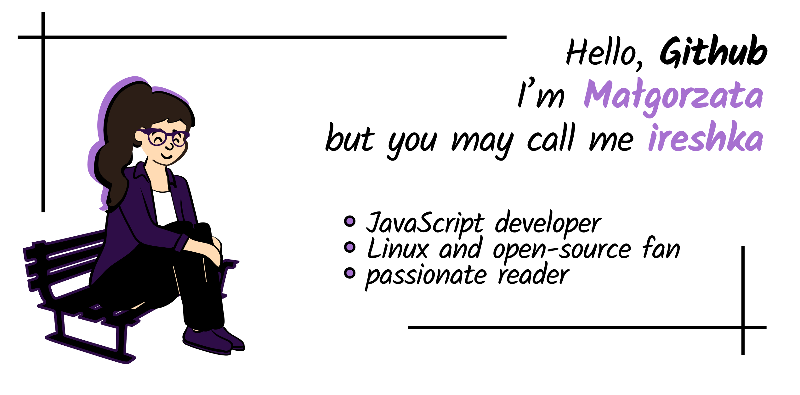

<h2 align="center">Hello Github :wave: </h2>
<h1 align="center">I'm Małgorzata but you may call me ireshka.
</h1>

I'm a **Warsaw** located programmer that chose javascript-related technologies and now mainly develops skills in **MERN stack** in direction of **full stack JS developer**.
For the past two years (with some breaks) I have been diving into the frontend world and now I'm motivated to **transform what was a personal interest into a more proffesional project**.

## Currently... :fire:
I'm currently focusing on expanding my **React** and **Node** knowledge as well as **Typescript** and **unit testing** topics.

On github you can find my older projects from workshops and initiatives I attended (everybody started somewhere) as well as team and individual projects that I'm working on now.

## Words to play with

## It matters not what you do - just that you enjoy it. What is best for me in programming? :heart:

- I have been an **Ubuntu fan for years** and I love the ideas of **open-source** and accessibility. I believe that the fact that no matter where we are or who we are we can access knowledge by use of the Internet is the most important world development of the last several decades. **I am excited that when I'm programming I can be a part of that**.

- I love to gain understanding of how and why things work as they work  (yes, **I like reading good-written documentation, it's my personal quirk**).

- **I like learning** and it's exciting that there is always something new waiting for discovery

- I like the **ability to customize solutions** and freedom of choosing the methods to solve problems (especialy with less popular but no less interesting technologies)

## My teamplay :dancers:

- contribute to [open-source project](https://github.com/Drugi-Legion-Gladiatorow) with [Gladiators Of Javascript](https://gladiators-of-javascript.com/) and [localhost academy](https://academy.localhost-group.com/) team

- contribute to open-source project with wzykio team - [Drug Doses](https://github.com/wzykio/drugdoses)

- attend [CodersCamp](https://coderscamp.edu.pl/) initiative and realise team projects that I now develop

## Some personal facts 💬:

I'm definitely a :last_quarter_moon_with_face: **night time person** (in central Europe timezone) so if you'd like to have an overnight programming talk session or project - here I am.

During free time :books: **I love reading** - mainly urban fantasy or dystopian fiction as well as reportage / non-fiction books. I also do a lot of :earth_africa: **travelling via Google Maps and Google Street View**.

